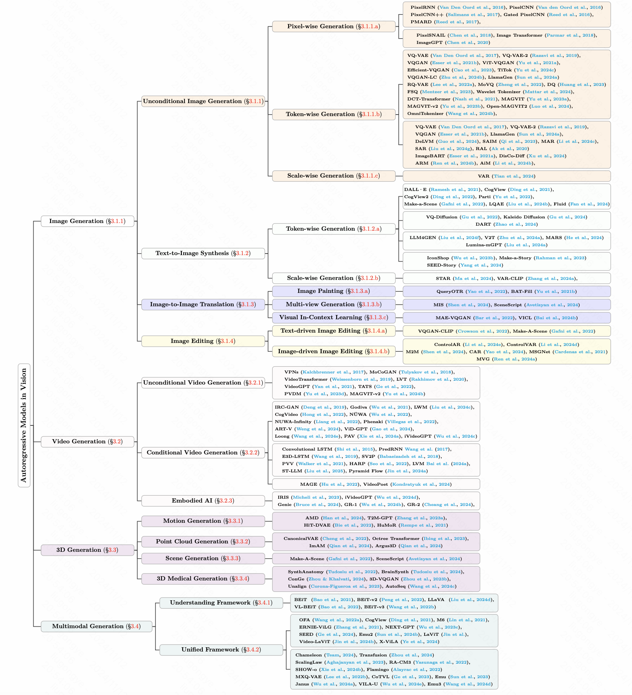

<div align=center>

</div>
<h2 align="center"> <a href="https://arxiv.org/abs/2411.05902"> Awesome Autoregressive Models in Vision <div align=center> </a></h2>
<h5 align="center"> If you like our project, please give us a star ⭐ on GitHub for the latest update.</h5>

<h5 align="center">

   [](https://awesome.re)
   [](https://arxiv.org/pdf/2411.05902.pdf)
   [](https://mp.weixin.qq.com/s/_O8W1qgvMZu37IKwgtskMA)
   [](https://hits.seeyoufarm.com)
   

</h5>

Autoregressive models have shown significant progress in generating high-quality content by modeling the dependencies sequentially. This repo is a curated list of papers about the latest advancements in autoregressive models in vision. **This repo is being actively updated, please stay tuned!**

> **Paper**: [Autoregressive Models in Vision: A Survey](https://arxiv.org/abs/2411.05902) | [[中文解读]](https://mp.weixin.qq.com/s/_O8W1qgvMZu37IKwgtskMA)

> **Authors**: *Jing Xiong<sup>1,†</sup>, Gongye Liu<sup>2,†</sup>, Lun Huang<sup>3</sup>, Chengyue Wu<sup>1</sup>, Taiqiang Wu<sup>1</sup>, Yao Mu<sup>1</sup>, Yuan Yao<sup>4</sup>, Hui Shen<sup>5</sup>, Zhongwei Wan<sup>5</sup>, Jinfa Huang<sup>4</sup>, Chaofan Tao<sup>1,‡</sup>, Shen Yan<sup>6</sup>, Huaxiu Yao<sup>7</sup>, Lingpeng Kong<sup>1</sup>, Hongxia Yang<sup>9</sup>, Mi Zhang<sup>5</sup>, Guillermo Sapiro<sup>8,10</sup>, Jiebo Luo<sup>4</sup>, Ping Luo<sup>1</sup>, Ngai Wong<sup>1</sup>*

> *<sup>1</sup>The University of Hong Kong, <sup>2</sup>Tsinghua University, <sup>3</sup>Duke University, <sup>4</sup>University of Rochester, <sup>5</sup>The Ohio State University, <sup>6</sup>Bytedance, <sup>7</sup>The University of North Carolina at Chapel Hill, <sup>8</sup>Apple, <sup>9</sup>The Hong Kong Polytechnic University, <sup>10</sup>Princeton University*

> *<sup>†</sup> Core Contributors, <sup>‡</sup> Corresponding Authors*

## 📣 Update News

`[2024-11-11]` We have released the survey: [Autoregressive Models in Vision: A Survey](https://arxiv.org/abs/2411.05902).

`[2024-10-13]` We have initialed the repository.

<div align=center>

</div>


## ⚡ Contributing

We welcome feedback, suggestions, and contributions that can help improve this survey and repository and make them valuable resources for the entire community.
We will actively maintain this repository by incorporating new research as it emerges. If you have any suggestions about our taxonomy, please take a look at any missed papers, or update any preprint arXiv paper that has been accepted to some venue.

If you want to add your work or model to this list, please do not hesitate to [pull requests]([https://github.com/ChaofanTao/autoregressive-vision-survey/pulls](https://github.com/ChaofanTao/autoregressive-vision-survey/pulls)).
Markdown format:

```markdown
* [**Name of Conference or Journal + Year**] Paper Name. [[Paper]](link) [[Code]](link)
```


## 📖 Table of Contents
- [📣 Update News](#-update-news)
- [⚡ Contributing](#-contributing)
- [📖 Table of Contents](#-table-of-contents)
  - [Image Generation](#image-generation)
    - [Unconditional/Class-Conditioned Image Generation](#unconditionalclass-conditioned-image-generation)
    - [Text-to-Image Generation](#text-to-image-generation)
    - [Image-to-Image Translation](#image-to-image-translation)
    - [Image Editing](#image-editing)
  - [Video Generation](#video-generation)
    - [Unconditional Video Generation](#unconditional-video-generation)
    - [Conditional Video Generation](#conditional-video-generation)
    - [Embodied AI](#embodied-ai)
  - [3D Generation](#3d-generation)
    - [Motion Generation](#motion-generation)
    - [Point Cloud Generation](#point-cloud-generation)
    - [3D Medical Generation](#3d-medical-generation)
  - [Multimodal Generation](#multimodal-generation)
    - [Unified Understanding and Generation Multi-Modal LLMs](#unified-understanding-and-generation-multi-modal-llms)
  - [Other Generation](#other-generation)
  - [Accelerating \& Stability \& Analysis \& Scaling](#accelerating--stability--analysis--scaling)
  - [Tutorial](#tutorial)
  - [Evaluation Metrics](#evaluation-metrics)
- [Star History](#star-history)
- [♥️ Contributors](#️-contributors)
- [📑 Citation](#-citation)

<div align=center>

</div>

-----

### Image Generation
#### Unconditional/Class-Conditioned Image Generation
  - ##### Pixel-wise Generation
    - **[ICML, 2020]** **ImageGPT:** Generative Pretraining from Pixels [Paper](https://proceedings.mlr.press/v119/chen20s/chen20s.pdf)
    - **[ICML, 2018]** **Image Transformer** [Paper](https://arxiv.org/pdf/1802.05751) [Code](https://github.com/neocxi/pixelsnail-public)
    - **[ICML, 2018]** **PixelSNAIL:** An Improved Autoregressive Generative Model [Paper](https://proceedings.mlr.press/v80/chen18h/chen18h.pdf) [Code](https://github.com/neocxi/pixelsnail-public)
    - **[ICML, 2017]** Parallel Multiscale Autoregressive Density Estimation [Paper](https://proceedings.mlr.press/v70/reed17a.html)
    - **[ICLR workshop, 2017]** **Gated PixelCNN**: Generating Interpretable Images with Controllable Structure [Paper](https://openreview.net/forum?id=Hyvw0L9el)
    - **[ICLR, 2017]** **PixelCNN++**: Improving the PixelCNN with Discretized Logistic Mixture Likelihood and Other Modifications [Paper](https://arxiv.org/pdf/1701.05517) [Code](https://github.com/openai/pixel-cnn)
    - **[NeurIPS, 2016]** **PixelCNN** Conditional Image Generation with PixelCNN Decoders [Paper](https://arxiv.org/pdf/1606.05328) [Code](https://github.com/anantzoid/Conditional-PixelCNN-decoder)
    - **[ICML, 2016]** **PixelRNN** Pixel Recurrent Neural Networks [Paper](https://arxiv.org/pdf/1601.06759) [Code](https://github.com/j-min/PixelCNN)
    
  - ##### Token-wise Generation
    
    ##### Tokenizer
    - **[Arxiv, 2025.02]** **FlexTok**: Resampling Images into 1D Token Sequences of Flexible Length [Paper](https://arxiv.org/pdf/2502.13967) 
    - **[Arxiv, 2025.01]** **ARFlow**: Autogressive Flow with Hybrid Linear Attention [Paper](https://arxiv.org/pdf/2501.16085) 
    - **[Arxiv, 2024.12]** **TokenFlow**: Unified Image Tokenizer for Multimodal Understanding and Generation [Paper](https://arxiv.org/abs/2412.03069) [Code](https://github.com/ByteFlow-AI/TokenFlow)
    - **[Arxiv, 2024.12]** Next Patch Prediction for Autoregressive Visual Generation [Paper](https://arxiv.org/abs/2412.15321) [Code](https://github.com/PKU-YuanGroup/Next-Patch-Prediction)
    - **[Arxiv, 2024.12]** XQ-GAN: An Open-source Image Tokenization Framework for Autoregressive Generation [Paper](https://arxiv.org/pdf/2412.01762) [Code](https://github.com/lxa9867/ImageFolder)
    - **[Arxiv, 2024.12]** RandAR: Decoder-only Autoregressive Visual Generation in Random Orders. [Paper](https://arxiv.org/pdf/2412.01827) [Code](https://github.com/ziqipang/RandAR) [Project](https://rand-ar.github.io/)
    - **[Arxiv, 2024.11]** Randomized Autoregressive Visual Generation. [Paper](https://arxiv.org/pdf/2411.00776) [Code](https://github.com/bytedance/1d-tokenizer) [Project](https://yucornetto.github.io/projects/rar.html)
    - **[Arxiv, 2024.09]** **Open-MAGVIT2**: Democratizing Autoregressive Visual Generation [Paper](https://arxiv.org/pdf/2409.04410) [Code](https://github.com/TencentARC/Open-MAGVIT2)
    - **[Arxiv, 2024.06]** **OmniTokenizer**: A Joint Image-Video Tokenizer for Visual Generation [Paper](https://arxiv.org/pdf/2406.09399) [Code](https://github.com/FoundationVision/OmniTokenizer)
    - **[Arxiv, 2024.06]** Scaling the Codebook Size of VQGAN to 100,000 with a Utilization Rate of 99% [Paper](https://arxiv.org/pdf/2406.11837) [Code](https://github.com/zh460045050/VQGAN-LC)
    - **[Arxiv, 2024.06]** **Titok** An Image is Worth 32 Tokens for Reconstruction and Generation [Paper](https://arxiv.org/pdf/2406.07550) [Code](https://github.com/bytedance/1d-tokenizer)
    - **[Arxiv, 2024.06]** Wavelets Are All You Need for Autoregressive Image Generation [Paper](https://arxiv.org/pdf/2406.19997) 
    - **[Arxiv, 2024.06]** **LlamaGen** Autoregressive Model Beats Diffusion: Llama for Scalable Image Generation [Paper](https://arxiv.org/pdf/2406.06525) [Code](https://github.com/FoundationVision/LlamaGen)
    - **[ICLR, 2024]**  **MAGVIT-v2** Language Model Beats Diffusion -- Tokenizer is Key to Visual Generation [Paper](https://arxiv.org/pdf/2310.05737)
    - **[ICLR, 2024]** **FSQ** Finite scalar quantization: Vq-vae made simple [Paper](https://arxiv.org/pdf/2309.15505) [Code](https://github.com/google-research/google-research/tree/master/fsq)
    - **[ICCV, 2023]** **Efficient-VQGAN:** Towards High-Resolution Image Generation with Efficient Vision Transformers [Paper](https://arxiv.org/abs/2310.05400)
    - **[CVPR, 2023]** Towards Accurate Image Coding: Improved Autoregressive Image Generation with Dynamic Vector Quantization [Paper](https://arxiv.org/pdf/2305.11718) [Code](https://github.com/CrossmodalGroup/DynamicVectorQuantization)
    - **[CVPR, 2023, Highlight]**  **MAGVIT:** Masked Generative Video Transformer [Paper](https://arxiv.org/pdf/2212.05199)
    - **[NeurIPS, 2023]**  **MoVQ:** Modulating Quantized Vectors for High-Fidelity Image Generation [Paper](https://arxiv.org/pdf/2209.09002)
    - **[BMVC, 2022]**  Unconditional image-text pair generation with multimodal cross quantizer  [Paper](https://arxiv.org/abs/2204.07537) [Code](https://github.com/ttumyche/MXQ-VAE)
    - **[CVPR, 2022]** **RQ-VAE** Autoregressive Image Generation Using Residual Quantization [Paper](https://arxiv.org/pdf/2203.01941) [Code](https://github.com/kakaobrain/rq-vae-transformer)
    - **[ICLR, 2022]** **ViT-VQGAN** Vector-quantized Image Modeling with Improved VQGAN [Paper](https://arxiv.org/pdf/2110.04627) 
    - **[PMLR, 2021]** Generating images with sparse representations [Paper](https://arxiv.org/pdf/2103.03841)
    - **[CVPR, 2021]** **VQGAN** Taming Transformers for High-Resolution Image Synthesis [Paper](https://arxiv.org/pdf/2012.09841) [Code](https://github.com/CompVis/taming-transformers)
    - **[NeurIPS, 2019]** Generating Diverse High-Fidelity Images with VQ-VAE-2 [Paper](https://arxiv.org/pdf/1906.00446) [Code](https://github.com/rosinality/vq-vae-2-pytorch)
    - **[NeurIPS, 2017]** **VQ-VAE** Neural Discrete Representation Learning [Paper](https://arxiv.org/pdf/1711.00937)

    
    ##### Autoregressive Modeling
    - **[Arxiv, 2025.01]** An Empirical Study of Autoregressive Pre-training from Videos [Paper](https://arxiv.org/pdf/2501.05453) 
    - **[Arxiv, 2024.12]** E-CAR: Efficient Continuous Autoregressive Image Generation via Multistage Modeling [Paper](https://arxiv.org/pdf/2412.14170)
    - **[Arxiv, 2024.12]** Taming Scalable Visual Tokenizer for Autoregressive Image Generation [Paper](https://arxiv.org/pdf/2412.02692) [Code](https://github.com/TencentARC/SEED-Voken)
    - **[Arxiv, 2024.11]** Sample- and Parameter-Efficient Auto-Regressive Image Models [Paper](https://arxiv.org/pdf/2411.15648) [Code](https://github.com/elad-amrani/xtra)
    - **[Arxiv, 2024.01]** Scalable Pre-training of Large Autoregressive Image Models [Paper](https://arxiv.org/abs/2401.08541) [Code](https://github.com/apple/ml-aim)
    - **[Arxiv, 2024.10]** ImageFolder: Autoregressive Image Generation with Folded Tokens [Paper](https://arxiv.org/abs/2410.01756) [Code](https://github.com/lxa9867/ImageFolder)
    - **[Arxiv, 2024.10]** **SAR** Customize Your Visual Autoregressive Recipe with Set Autoregressive Modeling [Paper](https://arxiv.org/abs/2410.10511) [Code](https://github.com/poppuppy/SAR)
    - **[Arxiv, 2024.08]** **AiM** Scalable Autoregressive Image Generation with Mamba [Paper](https://arxiv.org/pdf/2408.12245) [Code](https://github.com/hp-l33/AiM)
    - **[Arxiv, 2024.06]** **ARM** Autoregressive Pretraining with Mamba in Vision [Paper](https://arxiv.org/abs/2406.07537) [Code](https://github.com/OliverRensu/ARM)
    - **[Arxiv, 2024.06]** **MAR** Autoregressive Image Generation without Vector Quantization [Paper](https://arxiv.org/pdf/2406.11838) [Code](https://github.com/LTH14/mar)
    - **[Arxiv, 2024.06]** **LlamaGen** Autoregressive Model Beats Diffusion: Llama for Scalable Image Generation [Paper](https://arxiv.org/pdf/2406.06525) [Code](https://github.com/FoundationVision/LlamaGen)
    - **[ICML, 2024]** **DARL**: Denoising Autoregressive Representation Learning [Paper](https://arxiv.org/pdf/2403.05196) 
    - **[ICML, 2024]** **DisCo-Diff**: Enhancing Continuous Diffusion Models with Discrete Latents [Paper](https://arxiv.org/pdf/2407.03300) [Code](https://github.com/gcorso/disco-diffdock)
    - **[ICML, 2024]** **DeLVM**: Data-efficient Large Vision Models through Sequential Autoregression [Paper](https://arxiv.org/pdf/2402.04841) [Code](https://github.com/ggjy/DeLVM)
    - **[AAAI, 2023]** **SAIM** Exploring Stochastic Autoregressive Image Modeling for Visual Representation [Paper](https://arxiv.org/pdf/2212.01610) [Code](https://github.com/qiy20/SAIM)
    - **[NeurIPS, 2021]** **ImageBART**: Context with Multinomial Diffusion for Autoregressive Image Synthesis [Paper](https://arxiv.org/pdf/2108.08827) [Code](https://github.com/CompVis/imagebart)
    - **[CVPR, 2021]** **VQGAN** Taming Transformers for High-Resolution Image Synthesis [Paper](https://arxiv.org/pdf/2012.09841)  [Code](https://github.com/CompVis/taming-transformers)
    - **[ECCV, 2020]** **RAL**: Incorporating Reinforced Adversarial Learning in Autoregressive Image Generation [Paper](https://arxiv.org/pdf/2007.09923)
    - **[NeurIPS, 2019]** Generating Diverse High-Fidelity Images with VQ-VAE-2 [Paper](https://arxiv.org/pdf/1906.00446) [Code](https://github.com/rosinality/vq-vae-2-pytorch)
    - **[NeurIPS, 2017]** **VQ-VAE** Neural Discrete Representation Learning[Paper](https://arxiv.org/pdf/1711.00937)
    
  - ##### Scale-wise AutoRegressive Generation
    - **[Arxiv, 2024.12]** **FlowAR**: Scale-wise Autoregressive Image Generation Meets Flow Matching [Paper](https://arxiv.org/abs/2412.15205) [Code](https://github.com/OliverRensu/FlowAR)
    - **[Arxiv, 2024.11]** **M-VAR**: Decoupled Scale-wise Autoregressive Modeling for High-Quality Image Generation [Paper](https://arxiv.org/pdf/2411.10433) [Code](https://github.com/OliverRensu/MVAR)
    - **[NeurIPS 2024 Best Paper]** **Visual Autoregressive Modeling:** Scalable Image Generation via Next-Scale Prediction [Paper](https://arxiv.org/pdf/2404.02905) [Code](https://github.com/FoundationVision/VAR)

#### Text-to-Image Generation
- ##### Token-wise Generation
     - **[Arxiv, 2024.12]** Liquid: Language Models are Scalable Multi-modal Generators [Paper](https://arxiv.org/abs/2412.04332) [Code](https://github.com/FoundationVision/Liquid)
     - **[Arxiv, 2024.12]** Infinity: Scaling Bitwise AutoRegressive Modeling for High-Resolution Image Synthesis [Paper](https://arxiv.org/pdf/2412.04431) [Code](https://github.com/FoundationVision/Infinity)
     - **[Arxiv, 2024.12]** TokenFlow: Unified Image Tokenizer for Multimodal Understanding and Generation [Paper](https://arxiv.org/abs/2412.03069) [Code](https://github.com/ByteFlow-AI/TokenFlow)
     - **[Arxiv, 2024.11]** High-Resolution Image Synthesis via Next-Token Prediction [Paper](https://arxiv.org/pdf/2411.14808) [Code](https://d-jepa.github.io/t2i/)
     - **[Arxiv, 2024.10]** **Fluid**: Scaling Autoregressive Text-to-image Generative Models with Continuous Tokens [Paper](https://arxiv.org/abs/2410.13863)
     - **[Arxiv, 2024.10]** **DART**: Denoising Autoregressive Transformer for Scalable Text-to-Image Generation [Paper](https://arxiv.org/abs/2410.08159) [Code](https://github.com/daixiangzi/VAR-CLIP)
     - **[Arxiv, 2024.10]** **DnD-Transformer**: A Spark of Vision-Language Intelligence: 2-Dimensional Autoregressive Transformer for Efficient Fine-grained Image Generation [Paper](https://arxiv.org/abs/2410.01912) [Code](https://github.com/chenllliang/DnD-Transformer)
     - **[Arxiv, 2024.08]** **Lumina-mGPT**: Illuminate Flexible Photorealistic Text-to-Image Generation with Multimodal Generative Pretraining [Paper](https://arxiv.org/pdf/2408.02657) [Code](https://github.com/Alpha-VLLM/Lumina-mGPT)
     - **[Arxiv, 2024.07]** **MARS**: Mixture of Auto-Regressive Models for Fine-grained Text-to-image Synthesis [Paper](https://arxiv.org/pdf/2407.07614) [Code](https://github.com/fusiming3/MARS)
     - **[Arxiv, 2024.06]** **LLM4GEN**: Leveraging Semantic Representation of LLMs for Text-to-Image Generation [Paper](https://arxiv.org/pdf/2407.00737) [Code](https://github.com/YUHANG-Ma/LLM4GEN)
     - **[Arxiv, 2024.06]** **STAR**: Scale-wise Text-to-image generation via Auto-Regressive representations [Paper](https://arxiv.org/pdf/2406.10797) [Code](https://github.com/krennic999/STAR)
     - **[Arxiv, 2024.05]** **Kaleido Diffusion**: Improving Conditional Diffusion Models with Autoregressive Latent Modeling [Paper](https://arxiv.org/pdf/2405.21048)
     - **[CVPR, 2024]** **Beyond Text**: Frozen Large Language Models in Visual Signal Comprehension [Paper](https://arxiv.org/pdf/2403.07874) [Code](https://github.com/zh460045050/V2L-Tokenizer)
     - **[TOG, 2023]** **IconShop**: Text-Guided Vector Icon Synthesis with Autoregressive Transformers (*svg image*) [Paper](https://arxiv.org/pdf/2304.14400) [Code](https://github.com/kingnobro/IconShop)
     - **[NeurIPS, 2023]** **LQAE** Language Quantized AutoEncoders: Towards Unsupervised Text-Image Alignment [Paper](https://arxiv.org/pdf/2302.00902) [Code](https://github.com/lhao499/language-quantized-autoencoders)
     - **[TMLR, 2022.06]** **Parti**: Scaling Autoregressive Models for Content-Rich Text-to-Image Generation [Paper](https://arxiv.org/pdf/2206.10789) [Code](https://github.com/google-research/parti)
     - **[NeurIPS, 2022]** **CogView2**: Faster and Better Text-to-Image Generation via Hierarchical Transformers [Paper](https://arxiv.org/pdf/2204.14217) [Code](https://github.com/THUDM/CogView2)
     - **[ECCV, 2022]** **Make-A-Scene:** Scene-Based Text-to-Image Generation with Human Priors [Paper](https://arxiv.org/pdf/2203.13131) 
     - **[CVPR, 2022]** **VQ-Diffusion:** Vector Quantized Diffusion Model for Text-to-Image Synthesis [Paper](https://openaccess.thecvf.com/content/CVPR2022/html/Gu_Vector_Quantized_Diffusion_Model_for_Text-to-Image_Synthesis_CVPR_2022_paper.html) [Code](https://github.com/cientgu/VQ-Diffusion)
     - **[CVPR, 2022]** **Make-A-Story:** Visual Memory Conditioned Consistent Story Generation (*storytelling*) [Paper](https://arxiv.org/pdf/2211.13319) 
     - **[NeurIPS, 2021]** **CogView**: Mastering Text-to-Image Generation via Transformers [Paper](https://arxiv.org/pdf/2105.13290) [Code](https://github.com/THUDM/CogView)
     - **[Arxiv, 2021.02]** **DALL-E 1:** Zero-Shot Text-to-Image Generation [Paper](https://arxiv.org/pdf/2102.12092)
 
- ##### Scale-wise Generation
     - **[Arxiv, 2024.12]** Infinity: Scaling Bitwise AutoRegressive Modeling for High-Resolution Image Synthesis [Paper](https://arxiv.org/pdf/2412.04431) [Code](https://github.com/FoundationVision/Infinity)
     - **[Arxiv, 2024.12]** **SWITTI**: Designing Scale-Wise Transformers for Text-to-Image Synthesis [Paper](https://arxiv.org/pdf/2412.01819) [Code](https://github.com/yandex-research/switti) [Page](https://yandex-research.github.io/switti/)
     - **[Arxiv, 2024.10]** **HART**: Efficient Visual Generation with Hybrid Autoregressive Transformer [Paper](https://arxiv.org/abs/2410.10812) [Code](https://github.com/mit-han-lab/hart)
     - **[Arxiv, 2024.08]** **VAR-CLIP**: Text-to-Image Generator with Visual Auto-Regressive Modeling [Paper](https://arxiv.org/pdf/2408.01181) [Code](https://github.com/daixiangzi/VAR-CLIP)
     - **[Arxiv, 2024.06]** **STAR**: Scale-wise Text-to-image generation via Auto-Regressive representations [Paper](https://arxiv.org/pdf/2406.10797) [Code](https://github.com/krennic999/STAR)
  
#### Image-to-Image Translation
  - **[ICML Workshop, 2024]** **MIS** Many-to-many Image Generation with Auto-regressive Diffusion Models [Paper](https://arxiv.org/pdf/2404.03109) 
  - **[Arxiv, 2024.03]** **SceneScript**: Reconstructing Scenes With An Autoregressive Structured Language Model [Paper](https://arxiv.org/pdf/2403.13064) [Project](https://www.projectaria.com/scenescript/)
  - **[CVPR, 2024]** Sequential modeling enables scalable learning for large vision models [Paper](https://openaccess.thecvf.com/content/CVPR2024/html/Bai_Sequential_Modeling_Enables_Scalable_Learning_for_Large_Vision_Models_CVPR_2024_paper.html)
  - **[ECCV, 2022]** **QueryOTR**: Outpainting by Queries [Paper](https://arxiv.org/pdf/2207.05312) [Code](https://github.com/Kaiseem/QueryOTR)
  - **[NeurIPS, 2022]** Visual prompting via image inpainting [Paper](https://proceedings.neurips.cc/paper_files/paper/2022/hash/9f09f316a3eaf59d9ced5ffaefe97e0f-Abstract-Conference.html)
  - **[MM, 2021]** Diverse image inpainting with bidirectional and autoregressive transformers [Paper](https://arxiv.org/pdf/2104.12335)


#### Image Editing 
  - **[Arxiv, 2025.01]** EditAR: Unified Conditional Generation with Autoregressive Models [Paper](https://arxiv.org/pdf/2501.04699) [Code](https://github.com/JitengMu/EditAR)
  - **[Arxiv, 2024,06]** CAR: Controllable Autoregressive Modeling for Visual Generation [Paper](https://arxiv.org/abs/2410.04671) [Code](https://github.com/MiracleDance/CAR)
  - **[Arxiv, 2024,06]** **ControlAR**: Controllable Image Generation with Autoregressive Models [Paper](https://arxiv.org/abs/2410.02705) [Code](https://github.com/hustvl/ControlAR)
  - **[Arxiv, 2024,06]** **ControlVAR**: Exploring Controllable Visual Autoregressive Modeling [Paper](https://arxiv.org/pdf/2406.09750) [Code](https://github.com/lxa9867/ControlVAR)
  - **[Arxiv, 2024,06]** Medical Vision Generalist: Unifying Medical Imaging Tasks in Context [Paper](https://arxiv.org/pdf/2406.05565)
  - **[Arxiv, 2024,04]** **M2M** Many-to-many Image Generation with Auto-regressive Diffusion Models [Paper](https://arxiv.org/pdf/2404.03109)
  - **[ECCV, 2022]** **VQGAN-CLIP:** Open Domain Image Generation and Editing with Natural Language Guidance [Paper](https://arxiv.org/pdf/2204.08583)
  - **[ECCV, 2022]** **Make-A-Scene:** Scene-Based Text-to-Image Generation with Human Priors [Paper](https://arxiv.org/pdf/2203.13131)
  - **[ICIP, 2021]** **MSGNet:** Generating annotated high-fidelity images containing multiple coherent objects [Paper](https://arxiv.org/pdf/2006.12150)


### Video Generation
#### Unconditional Video Generation
   - **[Arxiv, 2025.02]** Next Block Prediction: Video Generation via Semi-Autoregressive Modeling [Paper](https://arxiv.org/abs/2502.07737) [Code](https://github.com/RenShuhuai-Andy/NBP)
   - **[Arxiv, 2025.01]** Taming Teacher Forcing for Masked Autoregressive Video Generation [Paper](https://arxiv.org/pdf/2501.12389) [Code](https://magivideogen.github.io/)
   - **[Arxiv, 2024.10]**  **LARP**: Tokenizing Videos with a Learned Autoregressive Generative Prior [Paper](https://arxiv.org/pdf/2410.21264)
   - **[ECCV 2024]** **ST-LLM**: Large Language Models Are Effective Temporal Learners [Paper](https://arxiv.org/pdf/2404.00308) [Code](https://github.com/TencentARC/ST-LLM)
   - **[ICLR, 2024]**  **MAGVIT-v2** Language Model Beats Diffusion -- Tokenizer is Key to Visual Generation [Paper](https://arxiv.org/pdf/2310.05737)
   - **[CVPR, 2023]** **PVDM** Video Probabilistic Diffusion Models in Projected Latent Space [Paper](https://openaccess.thecvf.com/content/CVPR2023/html/Yu_Video_Probabilistic_Diffusion_Models_in_Projected_Latent_Space_CVPR_2023_paper.html)
   - **[ECCV, 2022]**  Long Video Generation with Time-Agnostic VQGAN and Time-Sensitive Transformer [Paper](https://arxiv.org/pdf/2204.03638) [Code](https://github.com/SongweiGe/TATS)
   - **[Arxiv, 2021.04]** **VideoGPT**: Video generation using VQ-VAE and transformers [Paper](https://arxiv.org/pdf/2209.07143)
   - **[Arxiv, 2020.06]** Latent Video Transformer [Paper](https://arxiv.org/pdf/2006.10704) [Code](https://github.com/rakhimovv/lvt)
   - **[ICLR, 2020]** Scaling Autoregressive Video Models [Paper](https://arxiv.org/pdf/1906.02634)
   - **[CVPR, 2018]** **MoCoGAN**: Decomposing Motion and Content for Video Generation [Paper](https://openaccess.thecvf.com/content_cvpr_2018/papers/Tulyakov_MoCoGAN_Decomposing_Motion_CVPR_2018_paper.pdf) [Code](https://github.com/sergeytulyakov/mocogan)
   - **[ICML, 2017]** Video Pixel Networks [Paper](https://proceedings.mlr.press/v70/kalchbrenner17a.html?ref=https://githubhelp.com)

#### Conditional Video Generation
   - ##### Text-to-Video Generation
     - **[Arxiv, 2024.12]** **DiCoDe**: Diffusion-Compressed Deep Tokens for Autoregressive Video Generation with Language Models [Paper](https://arxiv.org/pdf/2412.04446) [Page](https://liyizhuo.com/DiCoDe/)
     - **[Arxiv, 2024.11]** Ca2-VDM: Efficient Autoregressive Video Diffusion Model with Causal Generation and Cache Sharing [Paper](https://arxiv.org/pdf/2411.16375) [Code](https://github.com/Dawn-LX/CausalCache-VDM/)
     - **[Arxiv, 2024.10]**  **ARLON**: Boosting Diffusion Transformers with Autoregressive Models for Long Video Generation [Paper](https://arxiv.org/pdf/2410.20502)  [Code](http://aka.ms/arlon)
     - **[Arxiv, 2024.10]**  Progressive Autoregressive Video Diffusion Models [Paper](https://arxiv.org/abs/2410.08151) [Code](https://github.com/desaixie/pa_vdm)
     - **[Arxiv, 2024.10]**  **Pyramid Flow**: Pyramidal Flow Matching for Efficient Video Generative Modeling [Paper](https://arxiv.org/pdf/2410.05954) [Code](https://github.com/jy0205/Pyramid-Flow)
     - **[Arxiv, 2024.10]**  **Loong**: Generating Minute-level Long Videos with Autoregressive Language Models [Paper](https://arxiv.org/pdf/2410.02757)
     - **[Arxiv, 2024.06]**  **Pandora**: Towards General World Model with Natural Language Actions and Video States [Paper](https://arxiv.org/pdf/2406.09455) [Code](https://github.com/maitrix-org/Pandora)
     - **[Arxiv, 2024.06]** **iVideoGPT**: Interactive VideoGPTs are Scalable World Models [Paper](https://arxiv.org/pdf/2405.15223) [Code](https://github.com/thuml/iVideoGPT)
     - **[Arxiv, 2024.06]** **ViD-GPT**: Introducing GPT-style Autoregressive Generation in Video Diffusion Models [Paper](https://arxiv.org/pdf/2406.10981) [Code](https://github.com/Dawn-LX/Causal-VideoGen)
     - **[Arxiv, 2024.02]** **LWM** World Model on Million-Length Video And Language With Blockwise RingAttention [Paper](https://arxiv.org/pdf/2402.08268) [Code](https://github.com/LargeWorldModel/LWM)
     - **[CVPR, 2024]** **ART-V**: Auto-Regressive Text-to-Video Generation with Diffusion Models [Paper](https://arxiv.org/pdf/2311.18834)
     - **[NeurIPS, 2022]** **NUWA-Infinity**: Autoregressive over Autoregressive Generation for Infinite Visual Synthesis [Paper](https://arxiv.org/pdf/2207.09814) [Code](https://github.com/microsoft/NUWA)
     - **[ECCV, 2022]** **NÜWA**: Visual Synthesis Pre-training for Neural visUal World creAtion [Paper](https://arxiv.org/pdf/2111.12417) [Code](https://github.com/microsoft/NUWA)
     - **[Arxiv, 2022.05]** **CogVideo**: Large-scale Pretraining for Text-to-Video Generation via Transformers [Paper](https://arxiv.org/pdf/2205.15868) [Code](https://github.com/THUDM/CogVideo)
     - **[Arxiv, 2022.05]** **GODIVA**: Generating Open-DomaIn Videos from nAtural Descriptions [Paper](https://arxiv.org/pdf/2104.14806)
     - **[IJCAI, 2021]** **IRC-GAN**: Introspective Recurrent Convolutional GAN for Text-to-video Generation. [Paper](https://www.ijcai.org/Proceedings/2019/0307.pdf)
    
     
   - ##### Visual Conditional Video Generation
     - **[Arxiv, 2024.10]**  **MarDini**: Masked Autoregressive Diffusion for Video Generation at Scale [Paper](https://arxiv.org/pdf/2410.20502)
     - **[CVPR, 2024]**  **LVM** Sequential Modeling Enables Scalable Learning for Large Vision Models [Paper](https://arxiv.org/pdf/2312.00785) [Code](https://github.com/ytongbai/LVM)
     - **[ICIP, 2022]** **HARP**: Autoregressive Latent Video Prediction with High-Fidelity Image Generator [Paper](https://arxiv.org/pdf/2209.07143)
     - **[Arxiv, 2021.03]** Predicting Video with VQVAE [Paper](https://arxiv.org/pdf/2103.01950)
     - **[CVPR, 2021]** Stochastic Image-to-Video Synthesis using cINNs [Paper](http://openaccess.thecvf.com/content/CVPR2021/papers/Dorkenwald_Stochastic_Image-to-Video_Synthesis_Using_cINNs_CVPR_2021_paper.pdf) [Code](https://github.com/CompVis/image2video-synthesis-using-cINNs)
     - **[ICLR, 2019]** Eidetic 3d lstm: A model for video prediction and beyond [Paper](https://openreview.net/pdf?id=B1lKS2AqtX)
     - **[ICLR, 2018]** Stochastic variational video prediction [Paper](https://openreview.net/pdf?id=rk49Mg-CW)
     - **[NeurIPS, 2017]** **Predrnn**: Recurrent neural networks for predictive learning using spatiotemporal lstms [Paper](https://proceedings.neurips.cc/paper_files/paper/2017/file/e5f6ad6ce374177eef023bf5d0c018b6-Paper.pdf)
     - **[NeurIPS, 2015]** Convolutional LSTM network: A machine learning approach for precipitation nowcasting [Paper](https://proceedings.neurips.cc/paper/2015/file/07563a3fe3bbe7e3ba84431ad9d055af-Paper.pdf)

   - ##### Multimodal Conditional Video Generation
      - **[Arxiv, 2025.01]** VideoAuteur: Towards Long Narrative Video Generation  [Paper](https://arxiv.org/abs/2501.06173) [Code](https://github.com/lambert-x/VideoAuteur)
      - **[Arxiv, 2024.12]** Autoregressive Video Generation without Vector Quantization [Paper](https://arxiv.org/pdf/2412.14169) [Code](https://github.com/baaivision/NOVA)
      - **[ICML, 2024]** **Video-LaVIT**:  Unified Video-Language Pre-training with Decoupled Visual-Motional Tokenization [Paper](https://arxiv.org/pdf/2402.03161) [Code](https://github.com/jy0205/LaVIT)
      - **[ICML, 2024]** **VideoPoet**: A Large Language Model for Zero-Shot Video Generation [Paper](https://arxiv.org/pdf/2312.14125)
      - **[CVPR, 2023]** **MAGVIT**: Masked Generative Video Transformer [Paper](https://arxiv.org/pdf/2212.05199)
      - **[CVPR, 2022]** Make it move: controllable image-to-video generation with text descriptions [Paper](http://openaccess.thecvf.com/content/CVPR2022/papers/Hu_Make_It_Move_Controllable_Image-to-Video_Generation_With_Text_Descriptions_CVPR_2022_paper.pdf) [Code](https://github.com/Youncy-Hu/MAGE)

#### Embodied AI
   - **[Arxiv, 2024.12]** **Diffusion-VLA**: Scaling Robot Foundation Models via Unified Diffusion and Autoregression [Paper](https://arxiv.org/abs/2412.03293) [Page](https://diffusion-vla.github.io/)
   - **[Arxiv, 2024.10]** **Gr-2**: A generative video-language-action model with web-scale knowledge for robot manipulation [Paper](https://arxiv.org/pdf/2410.06158)
   - **[Arxiv, 2024.05]** **iVideoGPT**: Interactive VideoGPTs are Scalable World Models [Paper](https://arxiv.org/pdf/2405.15223)
   - **[ICML, 2024]** **Genie:** Generative interactive environments [Paper](https://arxiv.org/pdf/2405.15223)
   - **[ICLR, 2024]** **GR-1** Unleashing Large-Scale Video Generative Pre-training for Visual Robot Manipulation [Paper](https://arxiv.org/pdf/2312.13139)
   - **[ICLR, 2023]** **IRIS** Transformers are sample-efficient world models [Paper](https://arxiv.org/pdf/2212.05199)
     
### 3D Generation
#### Motion Generation
  - **[Arxiv, 2024]** **ScaMo**: Exploring the Scaling Law in Autoregressive Motion Generation Model [Paper](https://arxiv.org/abs/2412.14559) [Code](https://github.com/shunlinlu/ScaMo_code)
  - **[AAAI, 2024]** **AMD**: Autoregressive Motion Diffusion [Paper](https://arxiv.org/pdf/2305.09381) [Code](https://github.com/fluide1022/AMD)
  - **[ECCV, 2024]** **BAMM**: Bidirectional Autoregressive Motion Model [Paper](https://arxiv.org/abs/2403.19435) [Code](https://github.com/exitudio/BAMM/?tab=readme-ov-file)
  - **[CVPR, 2023]**  **T2M-GPT**: Generating Human Motion from Textual Descriptions with Discrete Representations [Paper](https://arxiv.org/pdf/2301.06052)
  - **[Arxiv, 2022]** **HiT-DVAE**: Human Motion Generation via Hierarchical Transformer Dynamical VAE [Paper](https://arxiv.org/pdf/2204.01565)
  - **[ICCV, 2021 oral]** **HuMoR**: 3D Human Motion Model for Robust Pose Estimation [Paper](https://geometry.stanford.edu/projects/humor/docs/humor.pdf) [Code](https://github.com/davrempe/humor)

#### Point Cloud Generation
   - **[Arxiv, 2024.02]** Pushing Auto-regressive Models for 3D Shape Generation at Capacity and Scalability [Paper](https://arxiv.org/pdf/2402.12225)
   - **[ECCV, 2022]** Autoregressive 3D Shape Generation via Canonical Mapping [Paper](https://arxiv.org/pdf/2204.01955)
   - **[CVPR workshop, 2023]** Octree transformer: Autoregressive 3d shape generation on hierarchically structured sequences [Paper](https://arxiv.org/pdf/2111.12480)

#### 3D Medical Generation
  - **[arxiv, 2024]** Autoregressive Sequence Modeling for 3D Medical Image Representation [Paper](https://arxiv.org/pdf/2409.08691v1) 
  - **[arxiv, 2024]** Medical Vision Generalist: Unifying Medical Imaging Tasks in Context [Paper](https://arxiv.org/pdf/2406.05565) [Code](https://arxiv.org/pdf/2406.05565)
  - **[MIDL, 2024]** Conditional Generation of 3D Brain Tumor ROIs via VQGAN and Temporal-Agnostic Masked Transformer [Paper](https://openreview.net/pdf?id=LLoSHPorlM)
  - **[NMI, 2024]** Realistic morphology-preserving generative modelling of the brain [Paper](https://www.nature.com/articles/s42256-024-00864-0) [Code](https://github.com/AmigoLab/BrainSynth)
  - **[Arxiv, 2023]** Generating 3D Brain Tumor Regions in MRI using Vector-Quantization Generative Adversarial Networks [Paper](https://arxiv.org/pdf/2310.01251)
    ```medical image-to-image translation```
  - **[ICCV, 2023]** Unaligned 2D to 3D Translation with Conditional Vector-Quantized Code Diffusion using Transformers [Paper](https://openaccess.thecvf.com/content/ICCV2023/papers/Corona-Figueroa_Unaligned_2D_to_3D_Translation_with_Conditional_Vector-Quantized_Code_Diffusion_ICCV_2023_paper.pdf) [Code](https://github.com/samb-t/x2ct-vqvae)
  - **[MICCAI, 2022]** Morphology-preserving Autoregressive 3D Generative Modelling of the Brain [Paper](https://arxiv.org/pdf/2209.03177) [Code](https://github.com/AmigoLab/SynthAnatomy)
    ```medical image generation```

### Multimodal Generation
#### Unified Understanding and Generation Multi-Modal LLMs
  - **[Arxiv, 2025.2]** **HermesFlow**: Seamlessly Closing the Gap in Multimodal Understanding and Generation [Paper](https://arxiv.org/abs/2502.12148) [Code](https://github.com/Gen-Verse/HermesFlow)
  - **[Arxiv, 2025.2]** **QLIP**: Text-Aligned Visual Tokenization Unifies Auto-Regressive Multimodal Understanding and Generation [Paper](https://arxiv.org/pdf/2502.05178) [Code](https://github.com/NVlabs/QLIP)
  - **[Arxiv, 2025.1]** **Janus-Pro**: Unified Multimodal Understanding and Generation with Data and Model Scaling [Paper](https://github.com/deepseek-ai/Janus/blob/main/janus_pro_tech_report.pdf) [Code](https://github.com/deepseek-ai/Janus)
  - **[Arxiv, 2025.1]** **VARGPT**: Unified Understanding and Generation in a Visual Autoregressive Multimodal Large Language Model [Paper](https://pdf.arxiv.org/abs/2501.12327) [Code](https://github.com/VARGPT-family/VARGPT)
  - **[Arxiv, 2024.12]** **LlamaFusion**: Adapting Pretrained Language Models for Multimodal Generation [Paper](https://arxiv.org/pdf/2412.15188) 
  - **[Arxiv, 2024.12]** **MetaMorph**: Multimodal Understanding and Generation via Instruction Tuning [Paper](https://arxiv.org/pdf/2412.14164) [Page](https://tsb0601.github.io/metamorph/)
  - **[Arxiv, 2024.12]** **Orthus**: Autoregressive Interleaved Image-Text Generation with Modality-Specific Heads [Paper](https://arxiv.org/pdf/2412.00127)
  - **[Arxiv, 2024.12]** Multimodal Latent Language Modeling with Next-Token Diffusion. [Paper](https://arxiv.org/pdf/2412.08635) 
  - **[Arxiv, 2024.12]** **ILLUME**: Illuminating Your LLMs to See, Draw, and Self-Enhance. [Paper](https://arxiv.org/pdf/2412.06673) 
  - **[Arxiv, 2024.11]** **JanusFlow**: Harmonizing Autoregression and Rectified Flow for Unified Multimodal Understanding and Generation. [Paper](https://arxiv.org/pdf/2411.07975) [Project](https://github.com/deepseek-ai/Janus)
  - **[Arxiv, 2024.11]** Unified Generative and Discriminative Training for Multi-modal Large Language Models. [Paper](https://arxiv.org/pdf/2411.00304) [Project](https://sugar-mllm.github.io/)
  - **[Arxiv, 2024.09]** **Emu3**: Next-Token Prediction is All You NeedPaper Name. [Paper](https://arxiv.org/pdf/2409.18869) [Code](https://github.com/baaivision/Emu3) [Project](https://emu.baai.ac.cn/about)
  - **[Arxiv, 2024.10]** **D-JEPA**: Denoising with a Joint-Embedding Predictive Architecture [Paper](https://arxiv.org/abs/2410.03755) [project](https://d-jepa.github.io/)
  - **[Arxiv, 2024.10]** **Janus**: Decoupling Visual Encoding for Unified Multimodal Understanding and Generation [Paper](https://arxiv.org/pdf/2410.13848) [Code](https://github.com/deepseek-ai/Janus)
  - **[Arxiv, 2024.10]** **MMAR**: Towards Lossless Multi-Modal Auto-Regressive Probabilistic Modeling [Paper](https://arxiv.org/pdf/2410.10798) [Code](https://github.com/ydcUstc/MMAR)
  - **[Arxiv, 2024.10]** **ACDC**: Autoregressive Coherent Multimodal Generation using Diffusion Correction [Paper](https://arxiv.org/pdf/2410.04721) [Code](https://acdc2025.github.io/)
  - **[Arxiv, 2024.09]** **VILA-U**: a Unified Foundation Model Integrating Visual Understanding and Generation [Paper](https://arxiv.org/abs/2409.04429) [Code](https://github.com/mit-han-lab/vila-u)
  - **[Arxiv, 2024.09]** **MIO**: A Foundation Model on Multimodal Tokens [Paper](https://arxiv.org/pdf/2409.17692) 
  - **[Arxiv, 2024.08]** **Show-o:** One Single Transformer to Unify Multimodal Understanding and Generation [Paper](https://arxiv.org/pdf/2408.12528) [Code](https://github.com/showlab/Show-o)
  - **[Arxiv, 2024.08]** **Transfusion:** Predict the Next Token and Diffuse Images with One Multi-Modal Model [Paper](https://arxiv.org/pdf/2408.11039) [Code](https://github.com/lucidrains/transfusion-pytorch)
  - **[Arxiv, 2024.07]** **SEED-Story**: Multimodal Long Story Generation with Large Language Model [Paper](https://arxiv.org/pdf/2407.08683) [Code](https://github.com/TencentARC/SEED-Story)
  - **[Arxiv, 2024.05]**  **Chameleon**: Mixed-Modal Early-Fusion Foundation Models [Paper](https://arxiv.org/pdf/2405.09818) [Code](https://github.com/facebookresearch/chameleon)
  - **[Arxiv, 2024.04]** **SEED-X** Multimodal Models with UnifiedMulti-granularity Comprehension and Generation [Paper](https://arxiv.org/pdf/2404.14396) [Code](https://github.com/AILab-CVC/SEED-X)
  - **[ICML, 2024]** **Libra**: Building Decoupled Vision System on Large Language Models [Paper](https://arxiv.org/pdf/2405.10140) [Code](https://github.com/YifanXu74/Libra)
  - **[CVPR, 2024]** **Unified-IO 2**: Scaling Autoregressive Multimodal Models with Vision Language Audio and Action[Paper](https://arxiv.org/pdf/2312.17172) [Code](https://github.com/allenai/unified-io-2)
  - **[CVPR, 2024]** **Anole**: An Open, Autoregressive and Native Multimodal Models for Interleaved Image-Text Generation [Paper](https://arxiv.org/pdf/2407.06135) [Code](https://github.com/GAIR-NLP/anole)
  - **[Arxiv, 2023.11]** **InstructSeq**: Unifying Vision Tasks with Instruction-conditioned Multi-modal Sequence Generation [Paper](https://arxiv.org/pdf/2311.18835) [Code](https://github.com/rongyaofang/InstructSeq)
  - **[ICLR, 2024]** **Kosmos-G**: Generating Images in Context with Multimodal Large Language Models [Paper](https://arxiv.org/pdf/2310.02992) [Code](https://github.com/xichenpan/Kosmos-G)
  - **[ICLR, 2024]** **LaVIT**: Unified Language-Vision Pretraining in LLM with Dynamic Discrete Visual Tokenization [Paper](https://arxiv.org/pdf/2309.04669) [Code](https://github.com/jy0205/LaVIT)
  - **[ICLR, 2024]** **SEED-LLaMA** Making LLaMA SEE and Draw with SEED Tokenizer [Paper](https://arxiv.org/pdf/2310.01218) [Code](https://github.com/AILab-CVC/SEED)
  - **[ICLR, 2024]** **EMU** Generative Pretraining in Multimodality [Paper](https://arxiv.org/pdf/2307.05222) [Code](https://github.com/baaivision/Emu)
  - **[Arxiv, 2023.09]** **CM3Leon:** Scaling Autoregressive Multi-Modal Models: Pretraining and Instruction Tuning [Paper](https://arxiv.org/pdf/2309.02591) [Code](https://github.com/kyegomez/CM3Leon)
  - **[Arxiv, 2023.07]** **SEED** Planting a SEED of Vision in Large Language Model [Paper](https://arxiv.org/pdf/2307.08041) [Code](https://github.com/AILab-CVC/SEED)
  - **[NeurIPS, 2023]** **SPAE**: Semantic Pyramid AutoEncoder for Multimodal Generation with Frozen LLMs [Paper](https://arxiv.org/pdf/2306.17842)
  - **[ICLR, 2023]** **Unified-IO**: A unified model for vision, language, and multi-modal tasks [Paper](https://arxiv.org/pdf/2206.08916) [Code](https://unified-io.allenai.org/)
  - **[ICML, 2023]** Grounding Language Models to Images for Multimodal Inputs and Outputs [Paper](https://arxiv.org/pdf/2301.13823) [Code](https://github.com/kohjingyu/fromage)
  - **[NeurIPS, 2022]** **Flamingo**: a Visual Language Model for Few-Shot Learning [Paper](https://arxiv.org/pdf/2204.14198)
  - **[Arxiv, 2021.12]** **ERNIE-ViLG**: Unified Generative Pre-training for Bidirectional Vision-Language Generation [Paper](https://arxiv.org/pdf/2112.15283) 
  - **[KDD, 2021]** **M6:** A Chinese Multimodal Pretrainer [Paper](https://arxiv.org/pdf/2103.00823)

### Other Generation
  - **[Arxiv, 2025.02]** Poly-Autoregressive Prediction for Modeling Interactions [Paper](https://arxiv.org/pdf/2502.08646) 
  - **[Arxiv, 2025.02]** SongGen: A Single Stage Auto-regressive Transformer for Text-to-Song Generation [Paper](https://arxiv.org/abs/2502.13128) [Code](https://github.com/LiuZH-19/SongGen)
  - **[Arxiv, 2024.12]** DriveGPT: Scaling Autoregressive Behavior Models for Driving [Paper](https://arxiv.org/abs/2412.14415) 
  - **[TII, 2025]** VarAD: Lightweight High-Resolution Image Anomaly Detection via Visual Autoregressive Modeling [Paper](https://arxiv.org/abs/2412.17263) [Code](https://github.com/caoyunkang/VarAD)
  - **[Arxiv, 2024.12]** **DrivingGPT**: Unifying Driving World Modeling and Planning with Multi-modal Autoregressive Transformers [Paper](https://arxiv.org/abs/2412.18607) [Page](https://rogerchern.github.io/DrivingGPT/)
  - **[Arxiv, 2024.12]** Advancing Auto-Regressive Continuation for Video Frames [Paper](https://arxiv.org/pdf/2412.03758)
  - **[Arxiv, 2024.12]** It Takes Two: Real-time Co-Speech Two-person’s Interaction Generation via Reactive Auto-regressive Diffusion Model [Paper](https://arxiv.org/pdf/2412.02419)
  - **[Arxiv, 2024.12]** **X-Prompt**: Towards Universal In-Context Image Generation in Auto-Regressive Vision Language Foundation Models [Paper](https://arxiv.org/pdf/2412.01824) [Code](https://github.com/SunzeY/X-Prompt)
  - **[Arxiv, 2024.12]** **3D-WAG**: Hierarchical Wavelet-Guided Autoregressive Generation for High-Fidelity 3D Shapes [Paper](https://arxiv.org/pdf/2411.19037) [Code](https://github.com/TejaswiniMedi/3DWAG-AR)
  - **[Arxiv, 2024.11]** **SAR3D**: Autoregressive 3D Object Generation and Understanding via Multi-scale 3D VQVAE [Paper](https://arxiv.org/abs/2411.16856) [Code](https://github.com/cyw-3d/SAR3D)
  - **[Arxiv, 2024.11]** Scalable Autoregressive Monocular Depth Estimation [Paper](https://arxiv.org/pdf/2411.11361) 
  - **[Arxiv, 2024.11]** LLaMA-Mesh: Unifying 3D Mesh Generation with Language Models [Paper](https://arxiv.org/pdf/2411.09595) [Code](https://github.com/nv-tlabs/LLaMa-Mesh)
  - **[Arxiv, 2024.10]** DART: A Diffusion-Based Autoregressive Motion Model for Real-Time Text-Driven Motion Control [Paper](https://arxiv.org/pdf/2410.05260)
  - **[Arxiv, 2024.10]** Autoregressive Action Sequence Learning for Robotic Manipulation [Paper](https://arxiv.org/abs/2410.03132) [Code](https://github.com/mlzxy/arp)
  - **[Arxiv, 2024.09]** BAD: Bidirectional Auto-regressive Diffusion for Text-to-Motion Generation [Paper](https://www.arxiv.org/abs/2409.10847) [Code](https://github.com/RohollahHS/BAD)
  - **[Arxiv, 2024.07]** Video In-context Learning [Paper](https://arxiv.org/pdf/2407.07356)
  - **[CVPR, 2024]** Sequential Modeling Enables Scalable Learning for Large Vision Models [Paper](https://arxiv.org/pdf/2312.00785) [Code](https://github.com/ytongbai/LVM)
  - **[AAAI, 2024]** Autoregressive Omni-Aware Outpainting for Open-Vocabulary 360-Degree Image Generation [Paper](https://arxiv.org/pdf/2309.03467) [Code](https://github.com/zhuqiangLu/AOG-NET-360)
  - **[arxiv, 2024]** **LM4LV**: A Frozen Large Language Model for Low-level Vision Tasks [Paper](https://arxiv.org/pdf/2405.15734) [Code](https://github.com/bytetriper/LM4LV)
  - **[CVPR, 2024]** **ARTrackV2**: Prompting Autoregressive Tracker Where to Look and How to Describe [Paper](https://arxiv.org/pdf/2312.17133) [Code](https://github.com/MIV-XJTU/ARTrack)
  - **[CVPR, 2023 Highlight]** Autoregressive Visual Tracking [Paper](https://openaccess.thecvf.com/content/CVPR2023/papers/Wei_Autoregressive_Visual_Tracking_CVPR_2023_paper.pdf) [Code](https://github.com/MIV-XJTU/ARTrack)
  - **[CVPR, 2023]** **Visual Chain of Thought**: Bridging Logical Gaps with Multimodal Infillings [Paper](https://arxiv.org/pdf/2305.02317) 
  - **[NeurIPS, 2022]** Visual Prompting via Image Inpainting [Paper](https://arxiv.org/pdf/2209.00647) [Code](https://github.com/amirbar/visual_prompting)
  - **[EMNLP, 2022]** **MAGMA** – Multimodal Augmentation of Generative Models through Adapter-based Finetuning [Paper](https://arxiv.org/pdf/2112.05253)
  - **[NeurIPS, 2021]** Multimodal Few-Shot Learning with Frozen Language Models [Paper](https://arxiv.org/pdf/2106.13884)
  - **[ECCV, 2020]** Autoregressive Unsupervised Image Segmentation [Paper](https://arxiv.org/pdf/2007.08247)

### Accelerating & Stability & Analysis & Scaling & Safety
  - **[Arxiv, 2025.02]** Privacy Attacks on Image AutoRegressive Models [Paper](https://arxiv.org/abs/2502.02514) [Code](https://github.com/sprintml/privacy_attacks_against_iars)
  - **[Arxiv, 2025.01]** Can We Generate Images with CoT? Let's Verify and Reinforce Image Generation Step by Step [Paper](https://arxiv.org/abs/2501.13926) [Code](https://github.com/ZiyuGuo99/Image-Generation-CoT)
  - **[Arxiv, 2024.12]** Parallelized Autoregressive Visual Generation [Paper](https://arxiv.org/pdf/2412.15119) [Code](https://github.com/Epiphqny/PAR)
  - **[Arxiv, 2024.12]** Distilled Decoding 1: One-step Sampling of Image Auto-regressive Models with Flow Matching [Paper](https://arxiv.org/pdf/2412.17153) [Code](https://github.com/imagination-research/distilled-decoding)
  - **[Arxiv, 2024.12]** 3D representation in 512-Byte: Variational tokenizer is the key for autoregressive 3D generation [Paper](https://arxiv.org/pdf/2412.02202) [Page](https://sparse-mvs-2.github.io/VAT.IO/)
  - **[Arxiv, 2024.12]** JetFormer: An autoregressive generative model of raw images and text [Paper](https://arxiv.org/pdf/2411.19722) 
  - **[Arxiv, 2024.11]** Collaborative Decoding Makes Visual Auto-Regressive Modeling Efficient [Paper](https://arxiv.org/pdf/2411.17787) [Code](https://github.com/czg1225/CoDe)
  - **[Arxiv, 2024.11]** Continuous Speculative Decoding for Autoregressive Image Generation [Paper](https://arxiv.org/pdf/2411.11925) [Code](https://github.com/MarkXCloud/CSpD)
  - **[Arxiv, 2024.10]** Diffusion Beats Autoregressive: An Evaluation of Compositional Generation in Text-to-Image Models [Paper](https://arxiv.org/pdf/2410.22775) 
  - **[Arxiv, 2024.10]** Elucidating the Design Space of Language Models for Image Generation [Paper](https://arxiv.org/pdf/2410.16257) [Code](https://github.com/Pepper-lll/LMforImageGeneration)
  - **[NeurIPS, 2024]** Stabilize the Latent Space for Image Autoregressive Modeling: A Unified Perspective [Paper](https://arxiv.org/pdf/2410.12490) [Code](https://github.com/DAMO-NLP-SG/DiGIT)
  - **[Arxiv, 2024.10]** Accelerating Auto-regressive Text-to-Image Generation with Training-free Speculative Jacobi Decoding [Paper](https://arxiv.org/abs/2410.01699)
  - **[Arxiv, 2024.09]** Pre-trained Language Models Do Not Help Auto-regressive Text-to-Image Generation [Paper](https://arxiv.org/pdf/2311.16201)
  - **[ECCV, 2024]** An Image is Worth 1/2 Tokens After Layer 2: Plug-and-Play Inference Acceleration for Large Vision-Language Models [Paper](https://arxiv.org/pdf/2403.06764) [Code](https://github.com/pkunlp-icler/FastV)
  - **[Arxiv, 2020]** Scaling Laws for Autoregressive Generative Modeling [Paper](https://arxiv.org/abs/2010.14701)

### Tutorial
-  [UvA DL Notebooks](https://uvadlc-notebooks.readthedocs.io/en/latest/tutorial_notebooks/tutorial12/Autoregressive_Image_Modeling.html)
-  [MSC Deep Learning](https://hal.cse.msu.edu/teaching/2022-fall-deep-learning/18-autoregressive-models/#/2)


### Evaluation Metrics
| Metric                              | Analysis Type               | Reference                                            |
|-------------------------------------|-----------------------------|------------------------------------------------------|
| Inception Score (IS) ↑                | Quantitative              | [Salimans et al., 2016](https://arxiv.org/pdf/1606.03498)                                |
| Fréchet Inception Distance (FID)  ↓   | Quantitative              | [Heusel et al., 2017](https://arxiv.org/pdf/1706.08500)                                  |
| Kernel Inception Distance (KID)  ↓    | Quantitative              | [Binkowski et al., 2018](https://arxiv.org/pdf/1801.01401)                               |
| Precision and Recall ↑                | Quantitative              | [Powers, 2020](https://arxiv.org/pdf/2010.16061)                                         |
| CLIP Maximum Mean Discrepancy ↓       | Quantitative              | [Jayasumana et al., 2023](https://arxiv.org/pdf/2401.09603)                              |
| CLIP Score ↑                          | Quantitative              | [Hessel et al., 2021](https://arxiv.org/pdf/2104.08718)                                  |
| R-precision ↑                         | Quantitative              | [Craswell et al., 2009](https://doi.org/10.1007/978-0-387-39940-9_486)                   |
| Perceptual Path Length  ↓             | Quantitative              | [Karras et al., 2019](https://arxiv.org/pdf/1812.04948)                                  |
| Fréchet Video Distance (FVD) ↓        | Quantitative              | [Unterthiner et al., 2019](https://arxiv.org/pdf/1812.01717)                             |
| Aesthetic (Expert Evaluation) ↑       | Qualitative               | Based on domain expertise                                                                |
| Turing Test                           | Qualitative               | [Turing, 1950](https://academic.oup.com/mind/article/LIX/236/433/986238)                 |
| User Studies (ratings, satisfaction)↑ | Qualitative               | Various, depending on the user study methodology                                         |

## Star History

[](https://star-history.com/#ChaofanTao/Autoregressive-Models-in-Vision-Survey&Date)

## ♥️ Contributors

<a href="https://github.com/ChaofanTao/Autoregressive-Models-in-Vision-Survey/graphs/contributors">
  
</a>

## 📑 Citation

Please consider citing 📑 our papers if our repository is helpful to your work, thanks sincerely!

```BibTeX
@misc{xiong2024autoregressive,
    title={Autoregressive Models in Vision: A Survey},
    author={Jing Xiong and Gongye Liu and Lun Huang and Chengyue Wu and Taiqiang Wu and Yao Mu and Yuan Yao and Hui Shen and Zhongwei Wan and Jinfa Huang and Chaofan Tao and Shen Yan and Huaxiu Yao and Lingpeng Kong and Hongxia Yang and Mi Zhang and Guillermo Sapiro and Jiebo Luo and Ping Luo and Ngai Wong},
    year={2024},
    eprint={2411.05902},
    archivePrefix={arXiv},
    primaryClass={cs.CV}
}
```


